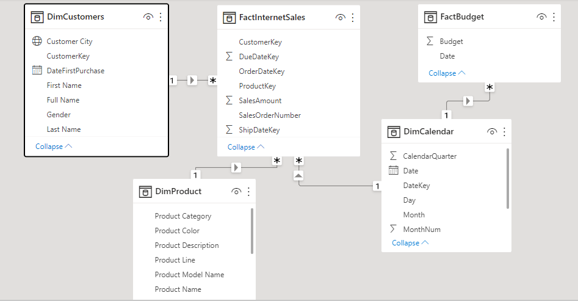
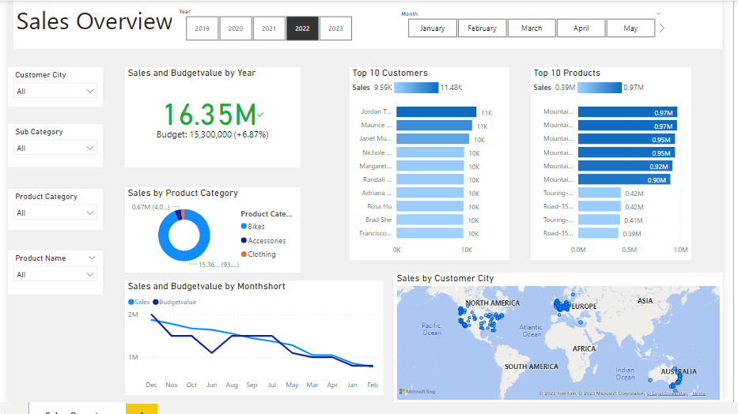

# Sales Analysis

## Objective

The business request for this data analyst project was an executive sales report for sales managers.
We are going to have some user cases to get insights from sales report such as detailed internet sales per customer,internet sales per products,sales comparision between sales and budget.

## Dataset

The data is collected from the sample AdventureWorksDW database.

## Data Cleaning and Transformation

To create the necessary data model for doing analysis and fulfilling the business needs defined in the user stories the following tables were extracted using SQL.

One data source (sales budgets) were provided in Excel format and were connected in the data model in a later step of the process.

## Data Modelling

Below is a screenshot of the data model after cleansed and prepared tables were read into Power BI.

This data model also shows how FACT_Budget hsa been connected to FACT_InternetSales and other necessary DIM tables.

-----------------------------------

## Sales Dashboard

The finished sales management dashboard focuses on sales over time, per customers and per products.

